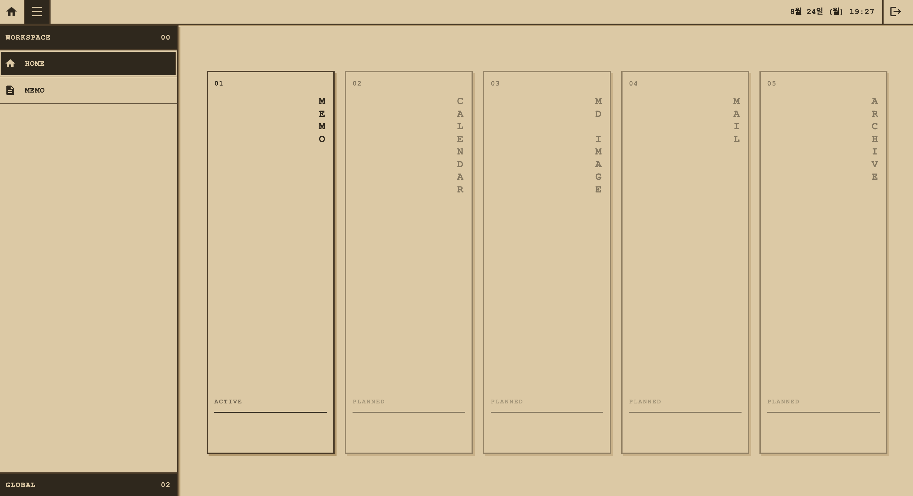
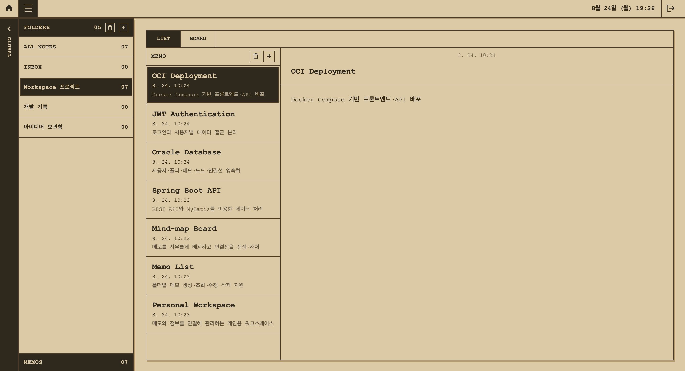
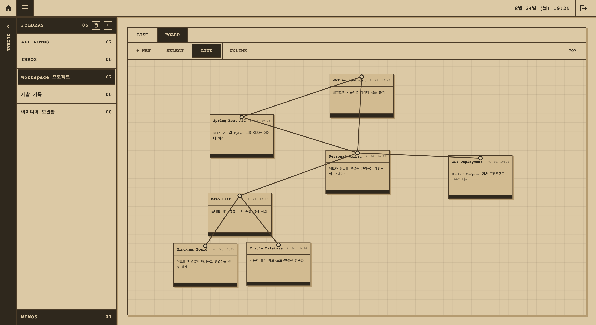

Personal Workspace

게임 인터페이스에서 영감을 받은 개인용 워크스페이스입니다.
일반적인 폴더형 메모 관리와 함께, 메모를 넓은 보드 위에 배치하고 관계선을 연결하여 생각의 구조를 시각화할 수 있습니다.

개인 프로젝트로 프런트엔드부터 백엔드, 데이터베이스 설계, 인증, 컨테이너화 및 클라우드 배포까지 전 과정을 구현했습니다.

Live Demo

- URL: http://161.33.167.137
  배포 환경: OCI Compute + Oracle Autonomous Database
  계정	이메일	비밀번호	용도
  Demo	demo@workspace.app	workspace1234!	기본 기능 시연
  Isolation	isolation@workspace.app	workspace1234!	사용자 데이터 분리 확인

현재 데모 서버는 HTTP로 제공됩니다. 브라우저가 HTTPS로 자동 전환하면 주소를 http://로 변경해야 합니다. 시연 계정에는 실제 개인정보를 입력하지 마세요.

프로젝트 목표

단순히 메모를 목록으로 저장하는 것을 넘어, 메모 사이의 관계와 배치를 사용자가 직접 구성할 수 있는 워크스페이스를 만드는 것이 목표입니다.

- 폴더 중심의 일반적인 메모 관리
- 넓은 보드에서 메모 위치와 계층을 자유롭게 조정
- 메모 사이의 관계선을 생성하고 해제
- 사용자별 데이터 소유권과 격리
- 새로고침과 재접속 후에도 동일한 작업 상태 복원
- 이후 캘린더, 이미지화, 메일 통합 등으로 확장 가능한 구조

주요 기능

인증과 사용자 분리

- 이메일과 BCrypt 해시 비밀번호 기반 로그인
- HS256 JWT 액세스 토큰 발급
- 보호 API에서 JWT의 사용자 ID를 추출
- 클라이언트가 전달하는 사용자 ID를 신뢰하지 않고 서버에서 소유권 검증
- 계정별 폴더, 메모, 보드 데이터 분리

폴더와 메모

- 사용자별 폴더 조회·생성·삭제
- 폴더별 메모 조회·생성·수정·삭제
- 제목과 본문의 지연 저장
- 폴더 삭제 시 내부 메모와 관련 보드 데이터 연쇄 삭제
- 선택된 메모가 없을 때의 빈 상태 UI
- 공용 확인 다이얼로그를 통한 삭제 확인

리스트 모드

- 폴더, 메모 목록, 편집 영역을 한 화면에서 관리
- ALL NOTES에서 전체 메모 조회
- 사이드 메뉴와 본문 폴더 선택 상태 동기화
- 메모 생성·선택·삭제 후 UI 상태 정리

보드 모드

- 메모 카드를 넓은 보드에 자유롭게 배치
- 보드 이동과 확대·축소
- 카드 좌표와 stack order 저장
- 메모 사이의 연결선 생성 및 해제
- 메모 삭제 시 관련 노드와 연결선 자동 삭제
- 실제 폴더 단위로 보드를 제한하여 관계 데이터의 범위 보장

기술 스택

Frontend

- React 19
- React Router 7
- Vite 8
- JavaScript / JSX
- CSS
- React Icons

Backend

- Java 25
- Spring Boot 4
- Spring Web MVC
- Spring Security OAuth2 Resource Server
- Spring Validation
- Spring Boot Actuator
- MyBatis
- Flyway

Database

- Oracle Database Free: 로컬 개발
- Oracle Autonomous AI Database 26ai: 공개 데모
- Oracle JDBC / mTLS Wallet

Infrastructure

- Docker / Docker Compose
- Nginx
- OCI Compute
- Oracle Autonomous Database

시스템 구성

flowchart LR
U[Browser] -->|HTTP :80| N[Nginx]
N -->|Static files| R[React]
N -->|/api reverse proxy| S[Spring Boot]
S -->|JWT authentication| A[Spring Security]
S -->|MyBatis + JDBC/mTLS| D[(Oracle Autonomous DB)]
F[Flyway] -->|Schema migration| D

- 외부에는 Nginx의 80번 포트만 공개합니다.
- Spring Boot 8080 포트는 Docker 내부 네트워크에서만 접근합니다.
- 공개 서버에서는 데이터베이스 컨테이너 대신 Autonomous Database를 사용합니다.
- mTLS Wallet은 이미지에 포함하지 않고 런타임에 읽기 전용으로 마운트합니다.

데이터 모델

erDiagram
WORKSPACE_USER ||--o{ MEMO_FOLDER : owns
MEMO_FOLDER ||--o{ MEMO : contains
MEMO ||--o| BOARD_NODE : has
MEMO_FOLDER ||--o{ BOARD_EDGE : groups
MEMO ||--o{ BOARD_EDGE : source
MEMO ||--o{ BOARD_EDGE : target

    WORKSPACE_USER {
        number USER_ID PK
        varchar EMAIL UK
        varchar PASSWORD_HASH
        varchar USER_NAME
        timestamp CREATED_AT
    }

    MEMO_FOLDER {
        number FOLDER_ID PK
        number USER_ID FK
        varchar FOLDER_NAME
        char IS_SYSTEM
        timestamp CREATED_AT
    }

    MEMO {
        number MEMO_ID PK
        number FOLDER_ID FK
        varchar TITLE
        clob CONTENT
        timestamp CREATED_AT
        timestamp UPDATED_AT
    }

    BOARD_NODE {
        number MEMO_ID PK,FK
        number POSITION_X
        number POSITION_Y
        number STACK_ORDER
    }

    BOARD_EDGE {
        number EDGE_ID PK
        number FOLDER_ID FK
        number SOURCE_MEMO_ID FK
        number TARGET_MEMO_ID FK
        varchar EDGE_TYPE
        timestamp CREATED_AT
    }

삭제 규칙은 데이터의 생명주기와 일치하도록 외래 키에 ON DELETE CASCADE를 적용했습니다.

사용자 삭제

└─ 폴더 삭제

└─ 메모 삭제

├─ 보드 노드 삭제

└─ 해당 메모가 포함된 연결선 삭제

핵심 설계

JWT에서 사용자 ID 결정

초기에는 요청 파라미터로 userId를 전달했지만, 사용자가 다른 ID를 넣어 타인의 데이터에 접근할 수 있는 문제가 있었습니다. 현재는 인증된 JWT의 subject에서 사용자 ID를 추출하고, 모든 폴더·메모·보드 API에서 이를 기준으로 소유권을 검사합니다.

보드 상태의 영속화

메모 내용과 화면 상태를 분리했습니다.

- MEMO: 제목과 본문
- BOARD_NODE: 좌표와 stack order
- BOARD_EDGE: 메모 사이의 연결 관계

이 구조를 통해 리스트 모드와 보드 모드가 같은 메모를 공유하면서도, 보드 상태를 독립적으로 저장하고 복원할 수 있습니다.

폴더 단위 연결선

연결선에 FOLDER_ID, SOURCE_MEMO_ID, TARGET_MEMO_ID를 저장하고 복합 외래 키로 동일 폴더의 메모만 연결되도록 제한했습니다. ALL NOTES는 조회 전용으로 두어 서로 다른 폴더의 관계가 섞이는 것을 방지했습니다.

Flyway 기반 스키마 관리

테이블을 수동으로 맞추지 않고, 사용자·폴더·메모·보드 노드·연결선 순서로 마이그레이션을 관리합니다. 새 환경에서 애플리케이션을 실행하면 동일한 스키마를 재현할 수 있습니다.

제한된 클라우드 자원에서의 배포

OCI Always Free 인스턴스의 제한된 메모리 안에서 실행할 수 있도록 다음을 적용했습니다.

- Oracle Database는 Autonomous Database로 분리
- Spring Boot 연결 풀 축소
- JVM 힙 제한 및 Serial GC 사용
- swap 구성
- ARM64 Mac에서 AMD64 서버용 Docker 이미지 교차 빌드
- 서버에서는 이미지를 빌드하지 않고 압축 이미지를 전달하여 로드

API
Method	Endpoint	설명
POST	/api/auth/login	로그인 및 JWT 발급
GET	/api/folders	사용자 폴더 조회
POST	/api/folders	폴더 생성
DELETE	/api/folders/{folderId}	폴더와 하위 데이터 삭제
GET	/api/memos	사용자 메모 조회
GET	/api/memos/{memoId}	메모 단건 조회
POST	/api/memos	메모 생성
PATCH	/api/memos/{memoId}	메모 수정
DELETE	/api/memos/{memoId}	메모 삭제
GET	/api/board/nodes	보드 노드 조회
PUT	/api/board/nodes/{memoId}	좌표와 순서 저장
GET	/api/board/edges	연결선 조회
POST	/api/board/edges	연결선 생성
DELETE	/api/board/edges/{edgeId}	연결선 해제
GET	/actuator/health	API 상태 확인

인증이 필요한 API는 다음 헤더를 사용합니다.

Authorization: Bearer <access-token>

로컬 실행

필요 환경

- Docker Desktop
- Docker Compose

환경변수

루트의 .env.example을 .env로 복사하고 값을 설정합니다.

cp .env.example .env

JWT 비밀키 생성:

openssl rand -base64 32

필수 환경변수:

SPRING_PROFILES_ACTIVE=prod,demo
PORT=8080
WORKSPACE_DB_URL=jdbc:oracle:thin:@//oracle:1521/FREEPDB1
WORKSPACE_DB_USERNAME=workspace_app
WORKSPACE_DB_PASSWORD=
ORACLE_PASSWORD=
WORKSPACE_JWT_SECRET=

실행

docker compose up -d --build

접속:

http://localhost:8081

상태 확인:

docker compose ps
docker compose logs --tail=100 api

중지:

docker compose down

데이터베이스 볼륨까지 삭제하려는 경우가 아니라면 --volumes를 사용하지 않습니다.

검증 시나리오

- 로그인하지 않은 보호 API 요청이 401을 반환하는지 확인
- 서로 다른 두 계정의 폴더와 메모가 분리되는지 확인
- 메모 위치 변경 후 새로고침해도 좌표가 유지되는지 확인
- 연결선 생성·해제 후 DB와 화면이 동기화되는지 확인
- 메모 삭제 시 노드와 연결선이 함께 제거되는지 확인
- 폴더 삭제 시 내부 메모와 보드 데이터가 함께 제거되는지 확인
- 컨테이너 재시작 후 데이터가 유지되는지 확인

프로젝트 구조

workspace-api/

├─ frontend/                         # React 애플리케이션

│  ├─ src/api/                       # API 및 인증 저장소

│  ├─ src/component/                 # 공용·레이아웃 컴포넌트

│  ├─ src/context/                   # 메모 전역 상태와 API 연동

│  └─ src/pages/                     # 로그인, 홈, 리스트, 보드 화면

├─ src/main/java/com/kousei/workspace/

│  ├─ auth/                          # 로그인, JWT, Security 설정

│  ├─ memo/folder/                   # 폴더 도메인

│  ├─ memo/note/                     # 메모 도메인

│  └─ memo/board/                    # 보드 노드와 연결선

├─ src/main/resources/

│  ├─ db/migration/                  # Flyway 버전 마이그레이션

│  ├─ db/demo/                       # 시연 데이터

│  └─ mapper/                        # MyBatis SQL 매퍼

├─ Dockerfile                        # Spring Boot 이미지

├─ compose.yaml                      # 로컬 Oracle 통합 환경

└─ compose.oci.yaml                  # OCI Autonomous DB 환경

현재 제한사항

- 공개 데모에 HTTPS가 적용되지 않았습니다.
- 자동화된 테스트보다 수동 통합 검증 비중이 높습니다.
- 메모 전역 상태와 API 로직이 MemoProvider에 집중되어 있어 역할별 분리가 필요합니다.
- 드래그 조작의 간헐적인 안정성 문제를 추가로 개선할 예정입니다.
- 현재 공개 버전의 중심 기능은 메모이며, 다른 워크스페이스 기능은 향후 확장 예정입니다.

향후 계획

- MemoProvider를 폴더·메모·보드 역할별로 분리
- 자동 테스트와 권한 회귀 테스트 추가
- 드래그 및 포인터 이벤트 안정화
- 폴더 이름 변경
- 연결 유형별 선 스타일 확장
- 게임 UI 애니메이션과 파티클 효과
- 캘린더, Markdown 이미지화, 메일 통합 기능
- 필요 시 HTTPS와 도메인 적용

Repository

- GitHub: https://github.com/neukdol30-ai/workspace
